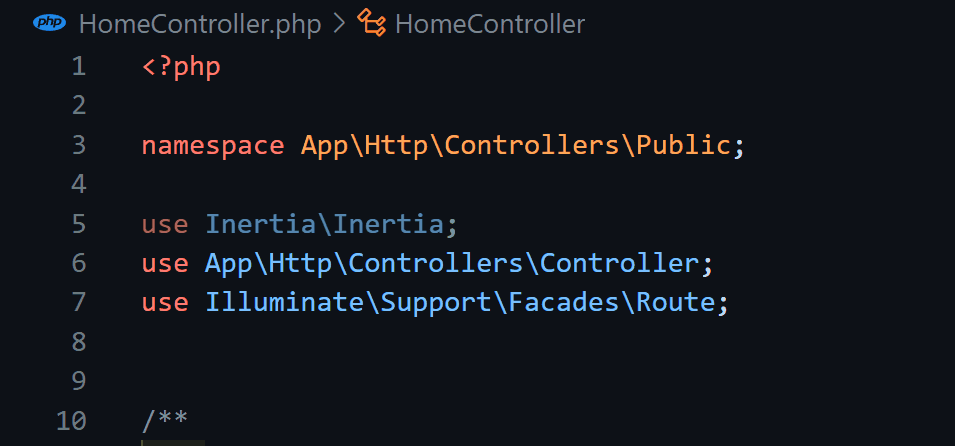

# PHP Use Organizer

Easily organise your ‘use’ lines in your PHP code. 😎
It's free and always will be. No abusive subscriptions for simple features.

[Github Repository](https://github.com/drxgb/php-use-organizer.git)

>⭐ Please consider to support the author giving to the repository a star ❤️

## Features

It's very simple: place the cursor into the line group that contains any `use` keyword, so the quick fix icon will appear and choose the `Sort uses` option.

## Requirements

No dependencies needed.

## Release Notes

### 1.0.0

- Sort uses through the quick fixes.

---

**Enjoy!**
